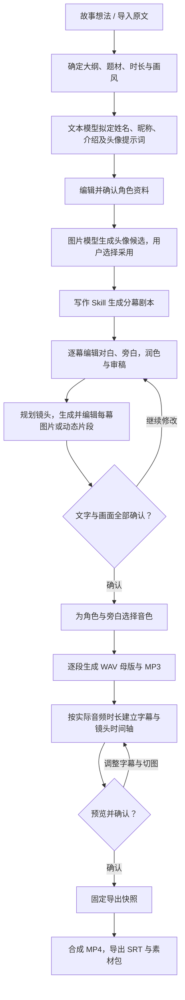

# MiniNovel

MiniNovel 是一个以分幕剧本为核心的 AI 有声小说视频创作工作台。用户从故事想法或已有小说开始，设定角色、编辑对白和场景画面，为角色分配音色，最终将插画、配音与字幕合成为视频。

产品采用 Web 前端，可在本机直接部署，也可通过 Docker 部署。文本、图片和视频各自支持多个供应商及模型，每类独立选择一个默认模型，初始配置为 Agnes AI。本地配音计划采用 Qwen3-TTS + MLX-Audio，在 Apple Silicon Mac 上运行。

**当前进度：M1、M2 已完成，M3–M8 尚未开始。** 当前可以运行本地服务、管理项目 API、保存模型配置，并且角色设定与剧本工作台已接入真实持久化：角色资料、分幕剧本、对白段落、镜头提示词的修改会自动保存到 SQLite，刷新和服务重启后保留。配音与视频工作台仍是交互原型。

## 产品能力与开发状态

| 能力 | 产品目标 | 当前状态 |
| --- | --- | --- |
| 项目管理 | 多项目独立保存、编辑、复制、归档与恢复 | 创建、查询、修改、归档及恢复 API 已实现；项目列表 UI 已接入，项目复制在 M3 |
| 模型配置 | 文本、图片、视频各配置多个供应商和模型，独立指定默认项 | 后端与设置页已实现持久化；实际连接测试尚未实现 |
| 角色设定 | AI 拟定姓名、昵称、介绍和头像提示词，用户确认后生成头像 | 资料编辑、确认与头像提示词已持久化；AI 生成在 M4，头像生成在 M5 |
| 分幕剧本 | 每幕包含对白、旁白和多个镜头，支持独立编辑 | 幕、段落、镜头已持久化，编辑自动保存；AI 创作在 M4 |
| Skill | 复用小说写作、去 AI 味、审稿及插画方法 | 候选配置界面；导入与执行在 M3 |
| 图片与动态镜头 | 单图重生成、候选采用、头像统一引用及短视频镜头 | 本地 SVG 示例；真实图片和视频生成尚未实现 |
| 角色配音 | 先选音色，再逐段生成 WAV 与 MP3，支持局部重做 | 音色选择原型；TTS 尚未接入 |
| 字幕与成片 | 用实际音频时长建立时间轴，预览并导出 MP4、SRT 与素材包 | 界面示意；真实对齐、预览与渲染尚未实现 |

开发按里程碑推进，每轮只完成一个里程碑。详细范围及验收记录见 [todo.md](todo.md)。

## 小说制作流程

以下是完整产品流程，实际生成能力将按 M4–M8 逐步实现。



制作对象按照“项目 → 剧集 → 幕”组织。一幕包括有序文字段落与镜头，每段对白只对应一个说话人，旁白作为独立说话人；舞台说明不参与配音。一个段落可以覆盖多个画面，音频仍只播放一次。

头像提示词与图片分开保存：`avatar` 是描述人物外貌、服装、表情和风格的文字，`avatarUrl` 是当前采用头像的资源引用。同一人物通过稳定 ID 关联各幕对白、头像与音色，改名不应创建新人物。

确认后的配音和导出使用固定输入版本。修改某段文字只更新该段音频及关联时间轴；更换角色音色只更新该角色受影响的段落；替换图片不应触发重新配音。这些版本与依赖规则属于后续里程碑的实现范围。

## 部署

默认访问地址为 `http://127.0.0.1:9513`。统一入口是 [scripts/deploy.sh](scripts/deploy.sh)，脚本自动定位项目目录。下列命令假设在项目根目录执行；完整参数、备份和排错说明见 [本地部署文档](docs/本地部署.md)。

### 快捷服务脚本

项目根目录提供三个快捷脚本，默认管理本机后台部署。

启动服务：

```bash
./start.sh
```

停止服务，保留数据库与素材：

```bash
./stop.sh
```

重启服务：

```bash
./restart.sh
```

管理 Docker 部署时，在对应脚本后加 `docker`：

```bash
./start.sh docker
```

```bash
./stop.sh docker
```

```bash
./restart.sh docker
```

这些入口复用 `scripts/deploy.sh`，支持相同的环境变量；本机停止与重启只管理脚本启动的后台进程，不接管前台运行或桌面预览服务。

### 方案一：本机直接部署

需要安装 uv。脚本使用 Python 3.12 和 `uv.lock` 中的锁定依赖，首次执行可能需要联网下载 Python 与软件包。Apple Silicon Mac 是后续本地 MLX 配音的目标环境。

安装依赖并后台启动：

```bash
./scripts/deploy.sh local start
```

也可以前台运行，按 Ctrl-C 停止：

```bash
./scripts/deploy.sh local run
```

查看状态：

```bash
./scripts/deploy.sh local status
```

查看最近 100 行日志：

```bash
./scripts/deploy.sh local logs
```

停止后台部署，保留数据库和素材：

```bash
./scripts/deploy.sh local stop
```

更新代码后重启：

```bash
./scripts/deploy.sh local restart
```

本机后台进程记录与日志位于 `.deploy/local/`。脚本只管理它自己启动的后台进程，不会按端口杀死其他应用，也不会接管桌面预览或手动启动的服务。同一代码目录只管理一个后台部署。

### 方案二：Docker 部署

需要 Docker 引擎和 Docker Compose，并先启动 Docker Desktop 或对应引擎。

构建镜像并启动，等待容器健康检查：

```bash
./scripts/deploy.sh docker start
```

查看状态：

```bash
./scripts/deploy.sh docker status
```

持续查看日志，Ctrl-C 只结束日志查看：

```bash
./scripts/deploy.sh docker logs
```

重新构建并重建容器，保留数据卷：

```bash
./scripts/deploy.sh docker restart
```

停止并移除容器，保留数据卷：

```bash
./scripts/deploy.sh docker stop
```

Docker 镜像以非 root 用户运行，宿主端口只绑定 `127.0.0.1`。SQLite 与项目素材保存在挂载到 `/data` 的命名卷中，容器重建不会删除数据。

Docker 部署 Web 应用不等于能够在 Linux 容器内运行 MLX。后续 Mac 本地配音需要宿主 TTS 服务及应用连接机制，当前尚未实现。

### 配置参数

| 参数 | 默认值 | 作用 |
| --- | --- | --- |
| `MININOVEL_PORT` | `9513` | 部署脚本使用的宿主访问端口 |
| `MININOVEL_DATA_DIR` | 本机项目下 `.data/` | 本机部署的数据目录，建议使用绝对路径；当前 Compose 固定使用容器 `/data` |
| `MININOVEL_COMPOSE_PROJECT` | `mininovel` | Docker Compose 项目名，决定容器与数据卷的命名空间 |
| `MININOVEL_HOST` | 手动运行时为 `127.0.0.1` | `run.py` 的监听地址；本机部署脚本固定回环地址，容器内使用 `0.0.0.0` |

本机部署使用其他端口：

```bash
MININOVEL_PORT=5180 ./scripts/deploy.sh local start
```

指定本机数据目录：

```bash
MININOVEL_DATA_DIR="$HOME/Library/Application Support/MiniNovel" ./scripts/deploy.sh local start
```

Docker 使用其他宿主端口：

```bash
MININOVEL_PORT=5180 ./scripts/deploy.sh docker start
```

两种部署默认使用同一端口，不能同时占用。需要并行运行时指定不同端口，数据保持独立；不要让两个实例同时访问同一个 SQLite 文件。Docker 默认卷名称通常为 `mininovel_mininovel-data`，改变 Compose 项目名会使用另一套数据卷。

脚本帮助：

```bash
./scripts/deploy.sh --help
```

## 当前数据存储

### 存储位置

本机默认布局如下；自定义数据目录时，将 `.data/` 替换为对应路径。

```text
MiniNovel/
├── .data/
│   ├── mininovel.sqlite3           # 项目、剧集、角色、剧本、供应商、模型、默认项、API Key
│   └── projects/
│       ├── demo-story/             # 演示项目素材目录
│       └── <project_id>/           # 创建项目时建立的独立素材目录
├── .deploy/
│   └── local/
│       ├── process.json            # 后台部署进程信息
│       ├── process.lock            # 部署操作锁
│       └── server.log              # 后台部署日志
└── assets/
    └── characters/                # 随代码分发的示例头像 SVG
```

Docker 中 `/data/mininovel.sqlite3` 和 `/data/projects/` 对应相同结构，由命名卷持久化；日志通过 Docker 读取。

`assets/` 中的示例图属于应用资源。它们不是 AI 生成结果，也不是某个真实项目的用户素材。M2 已建立完整的创作数据表；素材上传与生成文件写入从 M5 开始。

### 当前哪些内容会保存

| 内容 | 当前存储方式 | 刷新 / 重启后的行为 |
| --- | --- | --- |
| 项目名称、梗概、归档状态 | SQLite `projects` | 保留 |
| 剧集信息 | SQLite `episodes` | 保留；每项目默认一集 |
| 角色姓名、昵称、身份、介绍、头像提示词、采用头像、音色、确认状态 | SQLite `characters` | 保留 |
| 幕标题、地点、场景说明、顺序、确认状态 | SQLite `scenes` | 保留 |
| 段落说话人、对白/旁白类型、正文、情绪、顺序 | SQLite `paragraphs` | 保留；修改正文自动把所在幕置回待编辑 |
| 镜头提示词、采用图片引用、顺序 | SQLite `shots` | 保留 |
| 供应商、模型列表、默认模型、API Key | SQLite 对应表 | 保留；密钥不回显 |
| 配音页的音色选择 | SQLite `characters.voice` | 保留；实际 TTS 在 M6 |
| 镜头图片画面（示例 SVG / 前端绘制） | 应用资源或前端绘制 | 随代码保留，不是生成记录 |
| AI 任务、真实图片、语音、字幕与成片 | 尚未实现 | M3 起逐步接入 |

页面内编辑通过防抖自动保存；保存失败会以提示条显示错误。因此当前数据库可以完整恢复项目、角色与剧本的创作内容。

## 数据字典：当前 SQLite v3

数据库定义见 [server/database.py](server/database.py)。当前包含 10 张表；表中字段名是数据库字段名。

通用约定：

- `TEXT` 为文本，`INTEGER` 为整数；布尔状态以 `0` / `1` 保存。
- 时间由服务端生成，为带时区的 UTC ISO 8601 字符串。
- 新项目、角色、幕、段落和镜头 ID 使用 UUID 的 32 位十六进制字符串；演示项目使用固定 ID。
- 数据库版本记录在 `PRAGMA user_version`，当前为 `3`。启动时支持 v1 → v2 → v3 自动迁移；遇到更高版本拒绝启动，避免旧代码误用新结构。

### `projects`：项目元信息

| 字段 | 类型与约束 | 说明 |
| --- | --- | --- |
| `id` | TEXT，主键 | 项目稳定 ID，与 `projects/<id>/` 素材目录对应 |
| `name` | TEXT，非空 | 项目名称；API 限制为 1–120 字符，去除首尾空白 |
| `synopsis` | TEXT，非空，默认空字符串 | 故事梗概；API 最长 100,000 字符 |
| `is_demo` | INTEGER，非空，默认 `0` | 是否为演示项目；首次初始化的 `demo-story` 为 `1` |
| `archived` | INTEGER，非空，默认 `0` | 归档状态；归档不删除记录或素材 |
| `created_at` | TEXT，非空 | 创建时间 |
| `updated_at` | TEXT，非空 | 最后修改时间 |

默认列表隐藏归档项目，`include_archived=true` 可包含归档记录。当前未提供项目永久删除 API。

### `providers`：模型供应商

| 字段 | 类型与约束 | 说明 |
| --- | --- | --- |
| `id` | TEXT，主键 | 供应商 ID；内置项为 `agnes-text`、`agnes-image`、`agnes-video` |
| `capability` | TEXT，非空，枚举约束 | `text` / `image` / `video` |
| `name` | TEXT，非空 | 供应商显示名称；API 最长 100 字符 |
| `base_url` | TEXT，非空 | API 基础地址；API 字段名为 `url` |
| `created_at` | TEXT，非空 | 创建时间 |
| `updated_at` | TEXT，非空 | 最后修改时间 |

每个供应商记录只属于一种能力。同一厂商服务多种能力时分别配置，各自拥有模型列表和密钥。地址只接受 HTTP/HTTPS，不接受嵌入用户名、密码、查询参数或片段。

### `provider_models`：供应商可用模型

| 字段 | 类型与约束 | 说明 |
| --- | --- | --- |
| `provider_id` | TEXT，非空，外键 | 指向 `providers.id`；供应商删除时级联删除 |
| `model_id` | TEXT，非空 | 模型 ID；API 中每个模型最长 200 字符 |
| `position` | INTEGER，非空 | 模型列表顺序，由 `0` 开始 |

联合主键为 `(provider_id, model_id)`。不同供应商可以使用同名模型；同一供应商内去重，API 每次接受 1–100 个模型。

### `defaults`：各能力的默认模型

| 字段 | 类型与约束 | 说明 |
| --- | --- | --- |
| `capability` | TEXT，主键，枚举约束 | `text` / `image` / `video`，每类只有一条默认项 |
| `provider_id` | TEXT，非空，外键 | 默认模型所属供应商，必须属于相同能力 |
| `model_id` | TEXT，非空，联合外键 | 必须存在于所选供应商的模型列表中 |

API 中对应 `{provider, model}`。默认项是“能力 + 供应商 + 模型”的选择，不能只凭模型名称定位供应商。编辑列表时若移除当前默认模型，后端选择该供应商提交列表中的第一个模型作为新的默认项。

初始默认项为：

| 能力 | 供应商 ID | 模型 ID |
| --- | --- | --- |
| 文本 | `agnes-text` | `agnes-2.5-flash` |
| 图片 | `agnes-image` | `agnes-image-2.1-flash` |
| 视频 | `agnes-video` | `agnes-video-v2.0` |

### `provider_secrets`：供应商凭据

| 字段 | 类型与约束 | 说明 |
| --- | --- | --- |
| `provider_id` | TEXT，主键、外键 | 指向 `providers.id`，一条供应商对应一条凭据记录 |
| `api_key` | TEXT，非空 | 供应商 API Key，普通 SQLite 中未加密存储 |
| `updated_at` | TEXT，非空 | 最近一次设置密钥的时间 |

写入 API 字段名为 `apiKey`。新供应商可以不设置密钥；编辑时省略、留空或只填空白不会删除原密钥，填写新值会替换。配置和凭据在同一事务中提交。

配置读取接口只返回 `hasKey`，不返回 `api_key`。目前没有读取明文密钥或清除密钥的公开 API，也没有对应删除界面。

### `episodes`：剧集

| 字段 | 类型与约束 | 说明 |
| --- | --- | --- |
| `id` | TEXT，主键 | 剧集 ID；创建项目时自动建立默认剧集 |
| `project_id` | TEXT，非空，外键 | 指向 `projects.id`；项目删除时级联删除 |
| `title` | TEXT，非空，默认 `第 01 集` | 剧集标题 |
| `position` | INTEGER，非空，默认 `0` | 同项目内排序 |
| `created_at` / `updated_at` | TEXT，非空 | 创建 / 修改时间 |

当前每个项目自动使用第一个剧集；多剧集管理界面在后续里程碑评估。

### `characters`：角色与说话人

| 字段 | 类型与约束 | 说明 |
| --- | --- | --- |
| `id` | TEXT，主键 | 角色 ID；旁白也是一条记录 |
| `project_id` | TEXT，非空，外键 | 指向 `projects.id` |
| `name` | TEXT，非空 | 姓名；API 限制 1–120 字符 |
| `nickname` | TEXT，非空，默认空字符串 | 昵称 / 别名 |
| `role` | TEXT，非空，默认 `配角` | 故事身份：主角 / 重要配角 / 关键角色 / 配角 / 旁白 |
| `bio` | TEXT，非空，默认空字符串 | 角色介绍，API 最长 20,000 字符 |
| `avatar_prompt` | TEXT，非空，默认空字符串 | 头像生成提示词；API 字段名 `avatarPrompt` |
| `avatar_url` | TEXT，非空，默认空字符串 | 当前采用头像的引用；API 字段名 `avatarUrl` |
| `is_narrator` | INTEGER，非空，默认 `0` | 是否为旁白说话人；旁白不可删除 |
| `color` | TEXT，非空，默认 `slate` | 界面配色标识 |
| `voice` | TEXT，非空，默认空字符串 | 已选择的 TTS 音色 ID（M6 生成时使用） |
| `position` | INTEGER，非空，默认 `0` | 列表排序 |
| `confirmed` | INTEGER，非空，默认 `0` | 资料确认状态；修改姓名、昵称、身份、介绍或提示词自动清零 |
| `created_at` / `updated_at` | TEXT，非空 | 创建 / 修改时间 |

角色被段落引用时删除返回 409；需先调整这些段落的说话人。

### `scenes`：幕

| 字段 | 类型与约束 | 说明 |
| --- | --- | --- |
| `id` | TEXT，主键 | 幕 ID |
| `episode_id` | TEXT，非空，外键 | 指向 `episodes.id`；剧集删除时级联删除 |
| `title` | TEXT，非空，默认 `新的一幕` | 幕标题 |
| `place` | TEXT，非空，默认空字符串 | 场景地点 |
| `summary` | TEXT，非空，默认空字符串 | 场景说明，不参与配音与字幕 |
| `status` | TEXT，非空，枚举 `draft` / `done` | 内容确认状态；段落正文、说话人或类型变化自动回到 `draft` |
| `position` | INTEGER，非空，默认 `0` | 幕排序 |
| `created_at` / `updated_at` | TEXT，非空 | 创建 / 修改时间 |

### `paragraphs`：对白与旁白段落

| 字段 | 类型与约束 | 说明 |
| --- | --- | --- |
| `id` | TEXT，主键 | 段落 ID |
| `scene_id` | TEXT，非空，外键 | 指向 `scenes.id`；幕删除时级联删除 |
| `character_id` | TEXT，非空，外键 | 说话人；必须与所属幕同项目，接口校验 |
| `kind` | TEXT，非空，枚举 `dialogue` / `narration` | 对白 / 旁白 |
| `text` | TEXT，非空，默认空字符串 | 正文；API 最长 20,000 字符 |
| `emotion` | TEXT，非空，默认空字符串 | 演绎情绪备注（M6 传给 TTS） |
| `position` | INTEGER，非空，默认 `0` | 幕内排序 |
| `created_at` / `updated_at` | TEXT，非空 | 创建 / 修改时间 |

### `shots`：镜头

| 字段 | 类型与约束 | 说明 |
| --- | --- | --- |
| `id` | TEXT，主键 | 镜头 ID |
| `scene_id` | TEXT，非空，外键 | 指向 `scenes.id`；幕删除时级联删除 |
| `prompt` | TEXT，非空，默认空字符串 | 画面提示词，API 最长 8,000 字符 |
| `image_url` | TEXT，非空，默认空字符串 | 当前采用图片引用；M5 生成后写入 |
| `position` | INTEGER，非空，默认 `0` | 幕内排序 |
| `created_at` / `updated_at` | TEXT，非空 | 创建 / 修改时间 |

## 小说过程与结果的存储规划

以下是 M2–M8 的目标设计，**不是当前已经存在的数据库表或目录**。具体字段与路径将在各里程碑实现时确定，并同步更新此文档。

### 创作过程数据

结构化创作数据计划存入 SQLite；图片、声音和视频存文件，数据库保存它们的引用、版本、关联关系和生成来源。

| 对象 | 计划记录的主要数据 | 实现阶段 |
| --- | --- | --- |
| 剧集 | 所属项目、标题、顺序、比例、制作状态 | M2 |
| 角色 / 说话人 | 稳定 ID、姓名、昵称、介绍、头像提示词、采用头像、人物关系与确认状态；旁白独立标识 | M2 |
| 幕 | 所属剧集、标题、地点、时间、剧情目标、顺序、版本与确认状态 | M2 |
| 段落 | 所属幕、说话人 ID、对白/旁白类型、正文、朗读文本、舞台说明、顺序与版本 | M2 |
| 镜头 | 所属幕、提示词、人物参考、关联段落、采用素材与展示顺序 | M2、M5 |
| Skill 使用记录 | 来源、许可证、版本、适用阶段、输入范围与执行结果 | M3 |
| 生成任务 | 类型、目标对象、输入快照、供应商/模型、任务标识、状态、错误、用量与结果引用 | M3–M6 |
| 文字修订 / 候选 | 原版本、AI 修改提案、人工采纳结果和修改范围 | M4 |
| 素材版本 | 稳定 ID、项目归属、文件路径、来源任务、尺寸/时长、校验值与是否采用 | M5–M8 |
| 音色绑定 | 说话人、引擎、模型、音色 ID、语言、演绎参数和绑定版本 | M6 |
| 字幕与时间轴 | 段落音频起止、字幕块、镜头区间、停顿、切图与样式 | M7 |
| 确认快照与导出记录 | 固定的内容、素材和参数版本，以及导出任务状态和文件引用 | M8 |

任务“生成成功”和用户“确认采用”分开。新图或新配音先成为候选，不能自动覆盖已确认内容。任务执行期间如果输入变化，完成结果归属于原输入版本，供用户比较。

版本关联用于判断下游素材是否过期。例如朗读文本改变后，对应 MP3 需要重新生成；仅调整字幕颜色，则只更新字幕渲染。失败任务保留已完成结果，按可恢复任务标识查询，避免无条件重复提交。

### 文件素材与最终结果

建议的逻辑目录如下，用于说明分类；当前仅创建项目根素材目录，尚未创建这些业务子目录。

```text
projects/<project_id>/
├── source/                         # 导入原文等源文件
├── characters/<character_id>/      # 头像候选、采用头像、人物参考
├── episodes/<episode_id>/
│   ├── images/<shot_id>/           # 镜头图片候选与原始素材
│   ├── videos/<shot_id>/           # AI 动态镜头候选
│   ├── audio/<paragraph_id>/       # 段落音频版本：WAV 母版、MP3
│   ├── subtitles/                  # 字幕文件
│   └── previews/                   # 单幕或整集预览文件
└── exports/<export_id>/
    ├── video.mp4                   # 最终成片
    ├── subtitles.srt               # 与成片同一时间轴的字幕
    ├── script.json                 # 结构化剧本导出
    ├── manifest.json               # 素材、版本、时间轴和文件清单
    └── materials.zip               # 用户选择导出的素材包
```

文件应使用稳定对象 ID 与版本区分，避免改幕序号或人物名称后丢失关联。数据库记录采用版本及文件校验值，不把大体积音视频存为 SQLite BLOB，也不只保存供应商临时下载 URL。

配音按段落保存：每段对白或旁白对应一个 MP3，同时保留 WAV 母版。模型内部拆分产生的音频片段需要合并成该段的交付文件。视频渲染优先使用 WAV，减少重复有损编码，最终 MP4 音轨使用 AAC。

每次导出固定一份快照，MP4、SRT、剧本和素材清单引用同一版本。导出期间的编辑进入下一个版本，不改变正在生成的作品。素材包按明确的引用范围打包，不包含数据库、供应商 API Key、应用日志或无关项目文件。

## 数据保护、备份与恢复

本机和 Docker 都使用 SQLite 保存 API Key，不依赖 Mac Keychain。数据库未加密，**数据库及其备份包含明文凭据**。数据库文件权限设为 `0600`，默认创建的数据目录权限为 `0700`；已有自定义目录还需自行确认访问权限。

Web 服务不提供数据库和源码目录下载。项目素材接口会校验项目、文件路径和支持的媒体后缀；这些限制不等同于素材导出功能已实现。

备份与恢复原则：

1. 先停止对应实例，避免在应用写入时直接复制 SQLite。
2. 本机备份完整数据目录；Docker 备份完整命名卷。
3. 将备份保存在受限位置，不提交数据库、环境文件、日志或备份到仓库。
4. 恢复前停止服务，将完整备份放回原位置或指定新数据目录，再启动应用。
5. 当前数据库备份包含供应商凭据，迁移目录后不需要因 Keychain 命名变化重新设置；M2 前备份仍不包含页面内存里的小说编辑内容。

数据库备份用于恢复应用；素材包用于继续剪辑或分享作品，二者用途不同。停止、归档和重建容器都不自动物理清理项目素材。

## 当前 API

API 使用 JSON，同源 Web 前端通过 `/api` 调用。公开交互文档页面暂未开启，接口定义见 [server/app.py](server/app.py)。

| 方法 | 路径 | 用途 |
| --- | --- | --- |
| GET | `/api/health` | 服务状态、当前里程碑、生成开关 |
| GET | `/api/projects` | 项目列表，支持 `include_archived` |
| POST | `/api/projects` | 创建独立项目、默认剧集与旁白说话人 |
| GET | `/api/projects/{project_id}` | 查询项目元信息 |
| PATCH | `/api/projects/{project_id}` | 修改名称、梗概或归档状态；`archived=false` 恢复 |
| GET | `/api/projects/{project_id}/content` | 项目内容包：剧集、角色、幕（含段落与镜头） |
| POST | `/api/projects/{project_id}/characters` | 新增角色 |
| PATCH | `/api/characters/{character_id}` | 更新角色资料；内容字段变化会清除确认状态 |
| DELETE | `/api/characters/{character_id}` | 删除角色；被段落引用或为旁白时返回 409 |
| POST | `/api/projects/{project_id}/scenes` | 新增一幕 |
| PATCH | `/api/scenes/{scene_id}` | 更新幕标题、地点、说明或确认状态 |
| DELETE | `/api/scenes/{scene_id}` | 删除幕及其段落与镜头 |
| POST | `/api/projects/{project_id}/scenes/reorder` | 幕排序，请求体需包含全部幕 ID |
| POST | `/api/scenes/{scene_id}/paragraphs` | 新增对白或旁白段落 |
| PATCH | `/api/paragraphs/{paragraph_id}` | 更新段落；正文、说话人或类型变化会把所在幕置回待编辑 |
| DELETE | `/api/paragraphs/{paragraph_id}` | 删除段落 |
| POST | `/api/scenes/{scene_id}/paragraphs/reorder` | 段落排序 |
| POST | `/api/scenes/{scene_id}/shots` | 新增镜头 |
| PATCH | `/api/shots/{shot_id}` | 更新镜头提示词或采用图片 |
| DELETE | `/api/shots/{shot_id}` | 删除镜头 |
| GET | `/api/settings` | 供应商、模型、默认项和 `hasKey` 状态 |
| POST | `/api/providers` | 新增对应能力的供应商及模型列表，可同时设置 API Key |
| PUT | `/api/providers/{provider_id}` | 更新供应商配置；能力分类不能变更 |
| PUT | `/api/defaults/{capability}` | 设置该类默认供应商及模型 |
| GET | `/api/projects/{project_id}/assets/{asset_path}` | 读取项目内允许类型的媒体文件 |

M1 素材读取支持 PNG、JPEG、WebP、MP3、WAV 和 MP4。SRT、ZIP、结构化剧本下载及素材上传将在后续里程碑加入。

## 开发与验证

前端目前采用原生 HTML、CSS 和 JavaScript，无 Node 构建依赖；后端采用 FastAPI + SQLite。开发环境使用 Python 3.12。

安装开发依赖：

```bash
uv sync --python 3.12
```

手动启动：

```bash
uv run python run.py
```

运行测试：

```bash
uv run pytest -q
```

桌面预览配置在 `.claude/launch.json`，可选择 `MiniNovel` 或 `MiniNovel local deployment`。本机部署脚本只安装运行依赖，重新执行 `uv sync` 或 `uv run pytest -q` 可恢复开发依赖。

当前验证记录：20 项 Python 测试通过，覆盖项目隔离与归档、内容播种、角色/幕/段落/镜头生命周期、确认状态回退、跨项目说话人校验、配置与密钥持久化、v1→v2→v3 迁移、路径限制及部署进程识别。测试使用临时数据库和虚构密钥，不调用真实模型。测试依赖有一条关于 httpx TestClient 的弃用提示。

本机前台部署、后台 `start/restart/stop` 生命周期、健康检查已实测。浏览器实测：演示项目加载、对白编辑跨刷新保留、确认状态回退、空白新项目隔离、角色创建与资料自动保存、音色持久化、项目归档与切换。Docker Compose 配置校验通过，但开发机 Docker 引擎未运行，镜像构建和容器实际运行尚未验证。

## 项目结构与相关文档

```text
MiniNovel/
├── index.html / app.js / styles.css # Web 界面及原型交互
├── assets/                         # 应用示例图片
├── server/
│   ├── app.py                      # API 与受限静态资源服务
│   └── database.py                 # SQLite 表结构、初始化与迁移
├── run.py                          # 服务入口与监听参数
├── scripts/
│   ├── deploy.sh                   # 本机 / Docker 部署入口
│   └── local_deploy.py              # 本机后台进程管理
├── tests/                          # 数据、API 与部署测试
├── Dockerfile / compose.yaml       # 容器构建与数据卷配置
├── pyproject.toml / uv.lock         # 依赖声明与锁定
├── docs/                           # 产品、TTS 与部署文档
└── todo.md                         # 里程碑、验收与交付记录
```

- [产品策划文档](docs/产品策划文档.md)：业务结构、编辑与确认规则、成片验收。
- [TTS 方案选型](docs/TTS方案选型.md)：本地模型、角色音色、批量配音及评测计划。
- [本地部署文档](docs/本地部署.md)：完整部署命令、参数、备份和排错。
- [开发里程碑](todo.md)：M1–M8 范围与实际交付进度。
