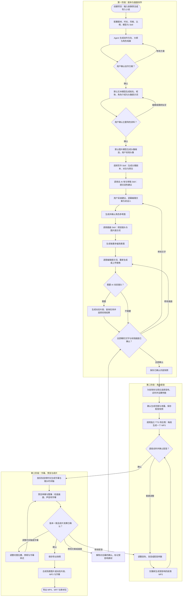

# MiniNovel 产品策划文档

> 版本：v0.1 · 初稿  
> 日期：2026-10-07  
> 产品定位：以可编辑剧本为核心、支持 Skill 的 AI 有声小说视频制作工具  
> 文档用途：确定产品范围、创作流程、编辑规则和验收标准，为原型设计与开发提供依据。

## 1. 产品概述

MiniNovel 帮助创作者把一个故事想法或已有小说，制作成多角色配音、场景插画和字幕组成的有声小说视频。

用户提出创作要求，Agent 调用小说写作、去 AI 味、插画等 Skill，生成由多幕组成的剧本及场景图片。用户逐幕修改和确认内容，为角色与旁白分配音色，再将每段对白或旁白生成独立 MP3，最后合成可预览、可下载的视频。

产品的核心资产是**可编辑的结构化剧本和它关联的素材**。所有生成结果都进入项目工作台，支持局部修改、重新生成、版本比较与再次导出。

### 1.1 用户需求与产品回应

| 用户需求 | 产品设计 |
| --- | --- |
| 接入文本、图片、视频三类模型，默认 Agnes AI | 统一供应商管理，按能力选择供应商与模型，预置 Agnes 三类模型 |
| 支持 Skill，复用成熟小说、去 AI 味、插画能力 | Skill 导入、按阶段组合、执行记录、兼容性检查与版本锁定 |
| 小说用剧本形式组织，每幕有文字和几幅图片 | 项目 → 幕 → 对白/旁白段落 + 画面镜头；画面绑定对应文字 |
| 文案尽量以对话呈现，环境与剧情介绍由旁白承担 | 明确说话人；区分配音文本、旁白、非朗读的舞台说明 |
| 每幕独立编辑，可修改文案和图片提示词 | 幕编辑器，文字直接编辑，单图重生成，历史版本与确认状态 |
| 内容确认后，为每个声音选音色，逐段输出 MP3 | 全部内容确认后进入配音；每个角色及旁白绑定音色；每段独立生成 |
| 将图片、MP3、字幕合成视频 | 以真实音频时长建立时间轴，安排画面与字幕，输出 MP4 |

### 1.2 本版默认假设

以下是为了让第一版需求具体可执行而采用的产品建议，可在后续设计时调整。

- 面向中文内容创作，首批主要服务个人作者和小型内容团队。
- 第一版为单人使用的 Web 创作工作台，生成和渲染任务由服务端或本地任务服务执行；部署方式暂不锁定。
- 优先打通约 3–10 分钟的单集制作，可保存连续剧集的共同角色与设定；大型长篇批量生产后续扩展。
- 默认输出竖屏 9:16，同时提供横屏 16:9；画面张数和幕数由内容与时长共同决定。
- 默认每幕规划 2–4 张场景图，用户可增减；一张图也允许成幕，系统提示画面可能单调。
- 默认以静态插画、轻微推拉和平移制作视频。AI 动态镜头作为可选镜头类型，第一版提供 Agnes 视频生成入口。
- 文本、图片、视频模型默认 Agnes AI；TTS 单独接入语音供应商。
- 本策划不绑定付费模式，不预设团队权限、自动发布和平台运营能力。

## 2. 用户与使用场景

### 2.1 目标用户

| 用户 | 主要任务 | 当前痛点 |
| --- | --- | --- |
| 小说作者 | 将自己的故事改编为有声视频 | 原文改剧本耗时，人物声音与画面难以统一 |
| 短视频创作者 | 连续制作悬疑、情感、爽文等故事视频 | 写作、生图、配音、字幕和剪辑分散在不同工具 |
| 小型内容工作室 | 批量制作系列内容 | 每次局部修改都牵连大量素材，难以追踪版本和成本 |

### 2.2 核心场景

**从想法开始。** 用户输入题材、故事梗概、受众、目标时长和风格，Agent 生成大纲、角色、分幕剧本和插画，用户修改确认后配音并导出视频。

**改编已有小说。** 用户粘贴文字或导入 TXT、Markdown，Agent 分析角色和情节，将叙述改编为对白与旁白，同时保留关键事实。无法确定的说话人和代词指代需要标注供用户处理。

**精修某一幕。** 用户发现对白生硬或人物形象不一致，只调整该幕对应文字、提示词或素材，然后更新受影响的配音和视频。

**继续制作下一集。** 用户复用已有角色、人物参考图、音色和视觉风格，为新剧集生成独立剧本和素材。

### 2.3 产品价值

1. 把分散工具连接成一条可重复执行的创作流程。
2. 让故事结构、说话人、画面和配音建立明确关联。
3. 允许用户在任何一幕进行人工创作与局部修订。
4. 通过成熟 Skill 提升写作和插画质量，减少重复建设。
5. 保存素材和版本，让再次修改只产生必要的生成费用。

## 3. 产品边界与版本范围

### 3.1 第一版必须完整提供的能力（P0）

| 模块 | 第一版范围 |
| --- | --- |
| 项目管理 | 创建、保存、打开、复制项目，维护剧集与共同设定 |
| 模型配置 | Agnes 文本、图片、视频接入；三类能力独立配置；TTS 独立接入 |
| Skill | 导入经过审核的 Skill 包；启停、按阶段使用、记录来源与版本 |
| 故事创作 | 从想法或原文生成大纲、角色、分幕剧本；局部改写与去 AI 味 |
| 剧本编辑 | 幕增删、排序、拆分合并；对白/旁白编辑；说话人调整；版本回退 |
| 场景图片 | 角色参考图、逐幕多图生成；提示词修改、单图重生成、上传替换 |
| 动态镜头 | 基础 Agnes 视频生成；异步任务查看；将结果绑定到单个镜头 |
| 内容确认 | 幕级确认、项目内容锁定；修改后标记受影响结果 |
| 配音 | 角色与旁白音色分配、试听、逐段 MP3、批量生成与单段重试 |
| 字幕与画面 | 音频驱动时间轴、逐段字幕、多图时序、静态镜头轻运动 |
| 视频输出 | 全片预览、单幕预览、MP4 导出、SRT 与素材包导出 |
| 任务恢复 | 持久化进度、错误说明、失败项重试、断点继续与用量记录 |

第一版允许 AI 动态镜头失败后由用户选择切换为场景图片；不得无提示替换。完整的静态图片有声视频流程必须独立可用。

### 3.2 下一阶段（P1）

- 更多经过验证的文本、图像、视频和 TTS 供应商预置适配。
- 更丰富的 Skill 模板、组合方案和回归评测。
- 更精细的字幕对齐、逐字高亮与自定义字幕样式。
- 配音局部情绪控制、多个旁白、用户音频上传替换。
- 背景音乐、环境音效和对白期间自动降低背景音量。
- 更自由的时间轴、镜头转场与多轨编辑。
- 连载情节追踪、角色成长记录与跨集素材复用增强。

### 3.3 暂不纳入首版

自动发布到内容平台、选题爬取、账号运营、复杂真人数字人、口型同步、实时配音、声音克隆、多人审批和支付系统。

本版要验证的是从故事到可编辑成片的制作闭环。

## 4. 核心内容结构

### 4.1 术语约定

| 概念 | 定义 |
| --- | --- |
| 项目 | 一部小说或系列作品的创作容器，保存共同角色、世界观、风格及供应商配置 |
| 剧集 | 一次可独立导出的作品，包含有序排列的幕 |
| 幕 | 本产品中可独立编辑的叙事场景，以一次连续事件或冲突为单位 |
| 段落 | 一位说话人的一段连续对白，或一段连续旁白，是配音的最小业务单位 |
| 舞台说明 | 对动作、环境、镜头的创作说明，默认不朗读、不进入字幕 |
| 镜头 | 一幅场景图或一个动态视频，以及它与段落的关联和展示方式 |
| 音色绑定 | 某个角色或旁白与供应商音色、配音参数的映射 |
| 确认快照 | 某次配音或导出所依据的固定剧本、素材、音色和版本集合 |

“幕”在这里用于产品组织，不要求严格遵循戏剧中 Act 的定义。不要把一张图片等同于一幕，也不要把一整幕的文字当作单个配音文件。

### 4.2 一幕包含的内容

- 基本信息：稳定 ID、标题、顺序、场景地点、时间、出场角色。
- 剧情目标：这一幕推进了什么、承接前后哪些情节点。
- 有序文本：对白、旁白，以及不参与朗读的舞台说明。
- 画面镜头：通常为多幅图片，可选动态镜头。
- 编辑信息：提示词、参考素材、生成版本、当前采用版本。
- 关联关系：每个镜头覆盖哪些文本段落，或覆盖段落内部的哪个位置。
- 制作状态：文字、画面是否确认；音频和渲染是否与当前版本一致。

### 4.3 段落规则

- 每段只有一个说话人；对话双方的轮流发言必须分开。
- 旁白也是独立说话人，拥有自己的音色。
- 情绪、停顿、动作说明保存为独立字段，不拼接进朗读文本。
- 用户可拆分或合并段落；合并要求说话人一致，跨角色合并需要先修改说话人。
- 每段生成一个可独立下载的 MP3；如果 TTS 长度限制要求拆成多个请求，内部合并后仍交付一个段落 MP3。
- 段落 ID 不随排序变化；重新排序只改变播放位置。
- 系统保存朗读文本与字幕文本。默认二者一致，字幕换行和样式调整不改变朗读内容。
- 若用户改变了字幕的实际措辞，系统提示可能与配音不同；用户可选择同步修改朗读文本或保留明确的显示差异。

### 4.4 角色档案

角色档案保存姓名、昵称/别名、角色介绍、年龄范围、关系、性格、说话习惯、外貌、服装、头像提示词、采用头像、参考图和音色绑定。

在分幕创作前提供独立的“角色设定”环节。Agent 根据故事梗概或原文，调用当前默认文本模型生成主要人物的姓名、昵称、角色介绍和 `avatar` 字段；其中 `avatar` 是图片生成提示词，不是图片地址。用户可逐项修改、确认，再用当前默认图片模型生成头像候选，采用后保存为独立的图片资源引用。

采用头像统一用于角色列表、剧本对白的圆形头像及配音页。同一角色以稳定 ID 关联资料与头像；修改姓名不会丢失段落关联。头像提示词改变后标记当前图待更新，新候选不自动替换已采用图。场景图片可引用人物外观资料及参考图，但不能仅凭小头像承诺人物一致性。

旁白作为独立说话人设置音色，以旁白图标显示，不纳入出场人物头像生成。

姓名变化不应创建新角色；同一个角色在所有幕中使用同一稳定 ID。临时角色需要生成简化档案，避免一段无主对白进入配音。

角色姓名与 TTS 音色不是一一排他的关系：用户可以让两个角色使用同一音色，系统提示可辨识度下降，但不强制阻止。

## 5. 创作流程与人工确认节点

### 5.1 标准流程

**创建项目 → 确认创作方向与大纲 → AI 拟定主要角色资料与头像提示词 → 编辑并确认角色 → 生成并采用头像 → 生成分幕剧本 → 去 AI 味与一致性检查 → 编辑文字 → 生成并编辑画面 → 全部内容确认 → 分配音色 → 逐段配音 → 检查字幕和时间轴 → 预览 → 导出。**

步骤之间允许返回修改。阶段切换必须检查输入是否齐备，而不是仅靠用户点击“下一步”。

以下流程图展示从故事输入到成片导出的主流程，以及人工确认和局部修改的回流路径。

文本、图片和动态视频默认使用 Agnes AI；配音通过独立 TTS 供应商完成。流程中的重新生成只针对受影响内容，仍与当前版本一致的素材直接复用。若仅修改画面，重新确认内容后可复用现有音色和 MP3；若修改朗读文本，则更新对应音频及关联时间轴。生成失败时保留已完成结果，修正原因后重试失败项。

### 5.2 内容生成阶段

1. 用户设置题材、梗概或原文、目标时长、视觉风格和输出比例。
2. Agent 给出创作方案：主题、主要矛盾、人物、分幕概要与预计制作量。
3. 用户确认或修改方案。
4. 默认文本模型拟定主要角色的姓名、昵称、介绍和头像提示词；用户编辑确认后，默认图片模型生成头像候选，由用户采用。
5. Agent 调用选定写作 Skill，生成结构化分幕剧本。
6. Agent 调用去 AI 味和审稿 Skill，检查语言、剧情及人物一致性。
7. 润色结果以差异形式呈现，用户采纳后成为当前版本。
8. 基于角色资料和采用参考图生成各幕镜头提示词与图片；必要时补充人物参考图。
9. 用户逐幕修改文字和画面，对每幕进行内容确认。

对话比例可以提供“低/中/高”偏好。产品默认对话优先，但不规定机械的百分比；需要补充时间、地点或无法通过对话自然说明的事件时使用旁白。

### 5.3 配音阶段

1. 全部幕的文字和采用画面已确认，形成内容快照。
2. 工作台汇总所有有台词的角色与旁白。
3. 用户为每个声音选择供应商音色，试听并设置可用参数。
4. 系统展示待生成段数、文字量、预计费用或“费用待供应商确认”。
5. 用户发起批量配音，每个段落输出独立 MP3。
6. 用户逐段试听，必要时修改发音或重新生成。
7. 音频确认后，按实际音频长度更新画面和字幕时间轴。

音色试听可以在内容确认前进行；正式批量配音默认在内容确认之后执行。

### 5.4 成片阶段

1. 检查文字、画面、音频、字幕是否对应同一版本。
2. 自动生成初始镜头时序和字幕时序。
3. 用户预览整集及单幕，调整切图位置、停顿和字幕样式。
4. 用户确认配音和时间轴，生成导出快照。
5. 渲染并输出视频；导出期间的新编辑进入下一个版本。

### 5.5 Agent 自主程度

默认是“分阶段自动执行、关键节点由用户确认”。

Agent 可以自动生成草稿、检查格式、规划镜头、整理素材和恢复不产生重复费用的查询任务。已经确认的内容，局部改写时必须作为约束传入。

批量生图、动态视频和正式配音在任务开始前展示规模及费用信息；一次批准覆盖这一批已展示的范围。新增数量、改用明显不同的模型或预算超限时再次确认。

## 6. 功能需求

### 6.1 项目与创作设置

创建项目时可填写：

| 字段 | 要求 |
| --- | --- |
| 项目名称、剧集名称 | 必填或由 Agent 提议后确认 |
| 输入方式 | 故事想法、粘贴原文、TXT/Markdown 文件 |
| 题材和受众 | 可选，允许自定义 |
| 目标时长 | 用于规划与估算；最终以实际音频为准 |
| 文案偏好 | 对话密度、旁白风格、节奏、禁用表达 |
| 视觉风格 | 插画、漫画、写实等；允许风格描述和参考图 |
| 视频比例 | 9:16 或 16:9 |
| 模型与 Skill 组合 | 默认使用项目模板，也可逐项覆盖 |

目标时长不应直接变成强制字数。前期根据可调整的语速估算文字量，配音完成后展示真实时长差异，让用户决定精简内容或延长作品。

自动保存文字、配置及已完成素材索引。复制项目默认复用原素材引用，新增编辑产生新版本，避免无意义地再次生成。

### 6.2 供应商与模型管理

用户可以分别设置：文本生成、图像生成、视频生成、TTS。统一显示配置入口，但各类接口独立适配。

文本、图片、视频每一类都支持配置多个供应商，每个供应商可维护多个可用模型。用户在每一类能力中选择一个默认模型，默认项由“供应商 ID + 模型 ID”共同标识，三类默认选择互不影响。初始均采用对应的 Agnes 模型。

设置页按能力分类，支持新增与编辑供应商、管理模型列表、测试连接和设为默认。切换默认模型只影响后续新任务；正在执行的任务、已生成素材及确认快照仍保留原供应商与模型。备用供应商不会在失败时自动产生新的付费调用，后续如支持自动切换需另行定义规则。

供应商配置包括名称、Base URL、认证信息、模型、能力声明、超时、并发和可用性测试。API Key 由服务端安全保存，界面只显示掩码。

**默认 Agnes 配置建议：**

| 能力 | 默认候选模型 | 公共文档中的端点 |
| --- | --- | --- |
| 文本、剧本与 Agent 调用 | `agnes-2.5-flash` | `/v1/chat/completions` |
| 图片生成与编辑 | `agnes-image-2.1-flash` | `/v1/images/generations` |
| 动态镜头生成 | `agnes-video-v2.0` | `/v1/videos` |
| TTS | 独立供应商，具体选择在接口验证阶段确定 | 由 TTS 适配器定义 |

Agnes 公共文档给出的 API Base URL 为 `https://apihub.agnes-ai.com/v1`。实现时须统一处理 `/v1`，避免重复拼接。视频是异步任务，公共 README 指定使用 `video_id`，通过 `https://apihub.agnes-ai.com/agnesapi?video_id=<VIDEO_ID>` 查询结果。[来源 1]

截至本次查阅，以上 Agnes 三模态公共 README 未列出 TTS。不能据此承诺 Agnes 的语音能力；后续若官方提供可验证接口，再加入语音适配器。

接入要求：

- 文本兼容接口不代表图片和视频接口自动兼容，需分别验证。
- 供应商更换只影响新任务；历史素材保留模型、参数和来源。
- 文本结构化输出、图像参考输入、视频时长、TTS 情绪参数均按实际能力展示。
- 对不支持的参数禁用控件并说明原因，不发送无效参数。
- 模型名称和默认值可更新；项目使用的具体模型版本需记录。
- 支持自定义兼容供应商配置；非兼容协议通过新增适配器接入。
- 不在策划中承诺固定价格或配额，实际以账号和供应商当前规则为准。

TTS 供应商首版选型标准：中文自然度、多角色可辨识音色、音色列表与试听、逐段合成、稳定获取音频、时长限制、商用使用条款、费用可见性。若返回非 MP3，内部转码为 MP3 并记录实际参数。

### 6.3 Skill 管理与复用

#### 产品原则

小说写作、去 AI 味和插画的专业方法优先复用现有 Skill。产品主要建设编排、编辑、素材关联、任务恢复和视频生产能力。

Skill 是指令、参考资料及可能包含的脚本集合，不是模型本身。复用需要完整处理它的依赖、输入输出和宿主能力。

#### 用户可见能力

- 查看已导入 Skill 的名称、用途、来源、版本和兼容状态。
- 从本地目录、压缩包或公开仓库导入 Skill，保留 `SKILL.md` 与关联资源。
- 选择写作、润色、审稿、插画阶段使用哪些 Skill，并保存项目模板。
- 查看 Agent 实际使用了哪些 Skill、处理了哪些幕、产生了哪些结果。
- 更新 Skill 前显示变更；已有项目固定原版本，新版本经测试后应用。

#### 第一版适配方式

把 Skill 分为三种状态：

| 类型 | 处理方式 |
| --- | --- |
| 提示与参考资料型 | 按任务加载相关指令和参考文件，输出交由产品校验 |
| 包含脚本和依赖 | 经人工审核，提供受限文件与执行环境后才启用 |
| 依赖专用宿主或工具 | 适配工具接口，或者标为待适配；禁止假装可直接执行 |

每个可执行 Skill 需要登记适用阶段、输入、输出、依赖工具、修改范围和允许的文件访问。缺少必要参考文件时应报告具体缺项。

#### 首批复用候选

| 需求 | 候选 | 已核验信息 | 适配重点 |
| --- | --- | --- | --- |
| 短篇/长篇创作、原文导入 | `zenstory-ai/oh-story-claudecode` 的 `story-short-write`、`story-long-write`、`story-import` | 仓库提供对应模块，MIT 许可证；2026-10-07 查询约 7.3k stars [来源 2] | 默认章节与字数习惯、文件结构、参考资料、宿主工具均需适配 |
| 去 AI 味 | 同仓库 `story-deslop` | 仓库模块存在；具体处理效果需样例评测 | 保留剧情事实、说话人、段落 ID；改写以差异形式提交 |
| 审稿与一致性 | 同仓库 `story-review` | 仓库模块存在；可能依赖原宿主执行机制 | 适配工具与流程，检查人物、剧情和已确认内容 |
| 插画与人物参考 | 本机 `story-to-handdrawn-video` | 已读取本机 Skill，明确只输出图片和文字，不渲染视频 | 依赖原项目和生成工具；需做供应商与素材接口适配 |
| 补充小说写作规则 | `fnb666888/claude-novel-skills` | MIT 许可证；本次查询 6 stars [来源 3] | 作为补充候选，不作为首版默认来源；先测试规则质量 |

以上为**待产品集成和评测的候选**，不代表已经安装、通过测试或能在本产品中直接运行。仓库 stars 只是社区规模信号，不能代替写作质量和兼容性验证；技能安装量本次未核验。

插画 Skill 可能默认将文字绘入图片、固定尺寸或依赖特定供应商。本产品应在保留来源与许可证的前提下建立明确的适配配置：视频素材默认不含对白文字，字幕独立叠加；采用项目比例和已选模型。如果来源不允许这种使用方式，就更换候选。

#### 必要的产品适配层

只补充已有 Skill 不负责的业务桥接：

1. 将创作结果转换为“角色—幕—段落—镜头”的结构化剧本。
2. 把镜头提示词、人物参考和生成素材关联到指定幕。
3. 将说话人映射为音色，组织逐段音频和时间信息。
4. 将素材和字幕编译成可渲染的时间轴。

这些能力可实现为应用工具或薄适配 Skill，不重新编写整套小说写作方法。

#### 复用验收

至少用悬疑、情感、日常三类固定样例测试：能否生成所需结构，能否自然改编成对白，能否保留事实与角色，能否只改指定幕，是否依赖不可用工具。通过后才进入默认模板。

外部 Skill 更新不能自动改写已确认作品；外部脚本不能读取供应商密钥或整个用户目录。

### 6.4 分幕剧本生成

每次生成须带入项目设定、角色档案、已确认大纲、当前前后幕摘要、用户偏好和选定 Skill。

生成目标：

- 每幕有明确事件或冲突，不为凑时长重复叙述。
- 对白有具体说话人和自然的口语节奏。
- 旁白承担必要的环境、时间、剧情补充。
- 舞台说明与可朗读文本分开。
- 同一角色的知识、关系和说话习惯前后一致。
- 不把创作提示、思考过程、模型解释写进正文或字幕。

输出先进行结构检查：角色引用有效、段落顺序明确、正文非空、没有混合说话人。格式错误可以要求模型修复，修复次数有上限，失败时保留原输出供人工处理。

去 AI 味是语言润色步骤，不能承诺检测分数或“百分之百像真人”。审稿结果应指出具体句子和问题，允许用户接受或忽略。

### 6.5 幕编辑器

#### 文字编辑

- 直接修改对白和旁白，不要求重新调用模型。
- 添加、删除、移动、拆分、合并段落。
- 修改说话人、情绪说明、停顿和发音备注。
- 对选定句子、段落或整幕发起 AI 改写。
- 改写前指定“保留的事实”和“希望变化的表达”。
- 展示新旧差异，用户采纳后更新当前版本。
- 对已确认内容再次编辑时，提示该幕确认失效及受影响素材。

#### 幕管理

添加、删除、排序、复制、拆分和合并幕。删除采用可恢复机制，素材和历史版本不立即物理清除。

拆分或合并后重新检查镜头与段落的关联。引用失效的镜头显示待分配，不默认丢弃。

#### 图片编辑

- 每个镜头独立保存提示词、参考图、风格及生成参数。
- 修改提示词后，可先保存，也可单独重新生成。
- 提示词已修改但图未更新时，显示“当前图片来自旧提示词”。
- 可保留旧图并说明选择，或采用新图；历史候选均可比较。
- 用户可上传图片，设置裁切与主体安全区。
- 支持镜头增删、重排和绑定段落。
- 生图完成仅表示生成成功，用户采用后才成为当前画面。

#### 局部修改范围

Agent 的“修改这一幕”操作只能提交这一幕的改动。若发现前后剧情有连带问题，另列建议，由用户决定是否扩大范围。

### 6.6 人物与画面生成

生成各幕插画前，优先建立并确认主要人物参考图。各镜头使用同一角色资料、参考图、视觉风格和必要的场景设定。

每个镜头的规划包含出场人物、动作、情绪、场景、景别、构图、提示词及关联段落。图片中的人物、服装、道具应服从角色档案及本幕事件。

角色一致性是可检查的质量目标，不能承诺仅靠 seed 就能完全保证。根据模型支持情况使用参考图、图生图或编辑功能；无参考图能力时明示限制并提供人工替换。

视觉风格或角色外观更新后，关联镜头进入“待复核”。文字改动是否影响画面由关联范围与内容判断：语气小改不强制重生图，事件和出场人物变化需要用户复核。

字幕安全区在预览中标示。原图不会默认写入台词，以便修改字幕、切换横竖屏和重复使用素材。

### 6.7 AI 动态镜头

动态镜头是某个镜头的可选素材，与图片一样归属具体幕。

首版支持：

- 使用 Agnes 生成短动态片段；有条件时以已确认图片作为参考输入。
- 用户编辑动态提示词、选择模型支持的尺寸与时长。
- 查看排队、生成、查询结果、下载和失败状态。
- 保留生成任务标识，关闭页面后可以恢复查询。
- 采用生成结果或继续使用原图片。

多图输入、关键帧等能力以正式参数和实测为准，第一版不将尚未验证的高级参数作为交付前提。

AI 视频只负责产生视觉素材，最终成片仍由渲染模块统一组合对白音频和字幕。来源视频若含音轨，默认静音以免混入非剧本声音。

### 6.8 音色分配与逐段配音

音色页面按“说话人”列出角色和旁白，显示出现幕数、段数、文字量、当前音色与试听入口。

可配置参数按供应商能力展示：语速、音量、情绪、停顿和发音控制。没有情绪参数的供应商不能显示可用的情绪调节滑块。

正文文本与 TTS 发音修正分开保存。专名、多音字和数字可配置读音或朗读形式，不必将字幕改成拼音。

批量配音规则：

- 一段对应一个 MP3，并记录真实时长。
- 已有匹配当前文本、音色和参数的音频可以复用。
- 手动要求“重新演绎”时，即使参数相同也允许生成新候选。
- 单段失败不使整个批次已成功的结果丢失。
- 音色更换仅标记该说话人的关联段落需要更新。
- 试听通过后可确认单段或批量确认。
- 用户可添加段前/段后停顿；停顿在时间轴中表达，不强制写入 MP3。

音频检查包括文件可解码、时长有效、是否明显空白或截断。自然度、情绪与读音最终由用户试听确认；自动检查不代替人工判断。

### 6.9 字幕生成

默认对白和旁白都显示字幕，可分别关闭；角色名前缀默认不显示，允许开启。

首版字幕精度为段落级：根据段落 MP3 的真实起止时间定位字幕。长段落可拆分为多个字幕块；没有词级时间信息时，按文字和停顿作初步分配，并明确可人工校正。

如供应商返回可靠的时间标记，或后续引入音频对齐工具，可提高到句级或词级。不能把按字数估算的时间宣传为精准逐字同步。

字幕配置包含字体、字号、颜色、描边、位置、行数和安全边距。支持常见中文字体，检查缺字和字体使用许可。

输出支持视频内嵌字幕和独立 SRT。内嵌字幕与 SRT 使用同一份时间数据。静音段和舞台说明默认不生成字幕。

### 6.10 时间轴与画面声音同步

时间轴以实际配音为基准。整幕时长为所有段落音频、段前段后停顿以及额外明确设置的无对白停留时间之和。

**首版采用段落锚点来绑定画面：**

- 镜头绑定一个或多个连续段落；幕开始、幕结束也可作为边界。
- 同一段覆盖多张图时，可按音频长度平均分配，再由用户调整相对切图位置。
- 调整使用相对于段落的比例或偏移，音频重生成后重新计算，并标记需要复核的手动位置。
- 无有效绑定时先生成整幕平均分配方案，并提示用户检查。
- 音频段落按文本顺序播放一次，镜头变化不能重复播放同一段对白。

静态图片可保持静止或使用轻微推拉、平移；默认幅度小，避免裁掉人物。首版用直接切换作为可靠默认效果。

动态素材适配：

| 情况 | 默认处理 |
| --- | --- |
| 动态片段长于镜头分配时间 | 裁取合适范围，用户可调整起点 |
| 动态片段短于镜头分配时间 | 保持末帧补足，并显示提示；用户可改为静态图或重生成 |
| 段落 MP3 更新导致镜头时长变化 | 重新计算对应镜头范围，保留用户调整记录并标记复核 |
| 没有对应画面 | 导出前阻止，提示用户采用图片、动态素材或明确的纯色画面 |

不为适应画面而默认拉伸对白语速。增加转场时须计入镜头总时长，避免字幕或声音相位错位。

### 6.11 预览与导出

预览支持整集、单幕和选定区间。进入预览前提示过期素材、未完成任务和缺失绑定。

默认导出规格：

| 项目 | 第一版建议 |
| --- | --- |
| 容器与视频编码 | MP4，H.264 |
| 音频 | AAC；源段落 MP3 保留 |
| 比例与分辨率 | 9:16：1080×1920；16:9：1920×1080 |
| 帧率 | 30 fps；输入动态素材按输出规范转换 |
| 字幕 | 可内嵌，同时支持 SRT 下载 |
| 素材导出 | 剧本、采用图片/视频、逐段 MP3、字幕、素材清单与时间轴数据 |

导出清单使用稳定 ID，保存字幕顺序、文件路径、段落与镜头关系及版本信息。音频文件名包含段落 ID，不依赖会变化的幕序号。

下载的素材包不包含 API Key；私人参考图和历史候选是否包含，由导出选项明确控制。

渲染可以采用 FFmpeg 等成熟工具完成，不自研编解码器。具体实现留待技术设计验证，产品验收关注最终文件、同步效果、稳定性和可重复导出。

## 7. 工作台与交互设计

### 7.1 页面结构

| 页面 | 核心内容与操作 |
| --- | --- |
| 项目列表 | 创建、打开、复制，显示最近编辑和制作状态 |
| 创作设置 | 故事输入、目标时长、题材、风格、比例、模型和 Skill |
| 故事规划 | 大纲、人物档案、分幕概要，确认或重新规划 |
| 幕工作台 | 幕导航、对白/旁白编辑、镜头与提示词、Agent 修改指令 |
| 配音工作台 | 说话人音色、试听、逐段 MP3、失败项与重生成 |
| 成片工作台 | 播放预览、画面和字幕时间轴、输出设置 |
| 设置与任务 | 供应商、Skill 管理、任务进度、用量和错误信息 |

### 7.2 幕工作台建议布局

- 左侧：幕列表，显示标题、出场角色和制作状态。
- 中间：当前幕的对白、旁白和舞台说明，逐段编辑。
- 右侧：当前幕的镜头卡片、图片候选、提示词和生成设置。
- 底部或可展开区域：当前幕预览及画面与段落关联。
- 侧边 Agent 面板：输入“让这句更自然”“第二张图改成夜景”等局部要求。

点击段落时定位关联镜头，点击镜头时高亮对应段落。Agent 输入框显示当前作用范围，避免用户误以为在修改整集。

### 7.3 关键交互

- “重新生成”明确针对一句、整幕、单图或选定范围。
- AI 改写先展示差异，接受后再成为当前文字。
- 单幕确认检查文字和每个采用画面，不把未采用候选纳入确认。
- 音频过期显示具体原因，例如“台词已修改”或“角色音色已更换”。
- 确认状态与生成状态分开：生成成功不代表用户认可。
- 大批量任务开始前展示数量、可能费用和已可复用素材数量。
- 任务失败保留已完成结果，提供针对性的重试操作。

## 8. 版本、确认与局部更新规则

### 8.1 内容状态与任务状态分离

内容状态：草稿、待复核、已确认。下游素材另有“与当前版本一致/已过期”标记。

任务状态：排队、执行中、成功、失败、取消、结果待核实。一个成功任务产生的图片仍可处于待复核状态。

项目内容锁定要求所有幕文字和采用画面已确认。进入导出还要求音频、字幕和镜头时间轴与当前版本一致，并由用户确认。

### 8.2 修改影响表

| 修改内容 | 立即影响 | 后续处理 |
| --- | --- | --- |
| 某句朗读文本或发音设置 | 该段 MP3 过期，关联字幕待更新 | 更新音频并重新计算相关画面时间；关联图片按剧情变化复核 |
| 某段说话人 | 该段音色映射和 MP3 过期 | 使用新说话人绑定生成音频，检查角色引用 |
| 角色音色或默认配音参数 | 该角色使用相应设置的段落 MP3 过期 | 只更新受影响段落；其他角色音频继续复用 |
| 单张图片提示词 | 当前图与提示词版本不一致 | 生成新候选或明确继续采用原图；确认后更新画面 |
| 采用图片或视频版本 | 对应镜头渲染过期 | 重新渲染采用该镜头的成片 |
| 角色外观或项目视觉风格 | 关联画面待复核 | 用户选择保留、替换或批量更新 |
| 幕或段落排序 | 时间轴与全片渲染过期 | 重排并重算字幕；可复用相同段落 MP3 |
| 字幕样式、换行 | 字幕渲染过期 | 更新渲染，不重新调用 TTS |
| 画面时长或切换点 | 镜头时间轴和渲染过期 | 更新预览与导出，不重新生图 |

“过期”表示不适用于当前编辑版本，历史文件和历史导出继续保留。

### 8.3 快照与冲突处理

正式批量配音基于已确认内容及音色快照；每次导出基于剧本、画面、音频、字幕和时间轴的完整快照。

生成任务启动后若用户修改了输入，旧任务的结果作为旧版本候选保存，不自动覆盖新的编辑。旧版本导出继续可下载，新版本需重新检查后生成。

所有图片、音频、视频记录实际输入、模型、Skill 版本和生成时间。相同参数不能保证随机生成模型输出相同，因此复现优先使用已保存素材。

## 9. Agent 编排与任务系统

### 9.1 编排职责

Agent 负责理解要求、选择适用 Skill、加载相关设定、调用工具、检查结果以及向用户报告需要复核的问题。

应用工具负责模型请求、素材保存、结构校验、TTS、时间轴、渲染和任务状态。文字生成可采用工具调用；即使供应商工具调用能力不足，也能由应用按固定阶段组织请求。

第一版采用一个主 Agent 和明确的阶段流程。是否使用子 Agent 由后续质量与成本评估决定，不作为首版必须条件。

### 9.2 建议的工具边界

| 工具能力 | 输入 | 输出 |
| --- | --- | --- |
| 生成/改写剧本 | 创作要求、设定、Skill、目标范围 | 结构化剧本或修改提案 |
| 生成图片 | 镜头提示词、参考图、模型参数 | 图片候选与生成记录 |
| 生成动态镜头 | 动态提示词、参考素材、参数 | 任务标识与视频候选 |
| 获取音色、生成语音 | 音色选择、朗读文本、参数 | 逐段音频与实际时长 |
| 建立时间轴 | 段落、音频、镜头、字幕设置 | 可预览的时间轴 |
| 渲染导出 | 已确认快照与输出参数 | MP4、字幕与导出清单 |

### 9.3 长任务与失败处理

- 生图、视频、配音和渲染均保存任务状态，刷新页面不丢进度。
- 按供应商限制控制并发，限流时退避；并发不可只按本地机器能力决定。
- 验证输入错误和认证错误不反复自动重试。
- 请求超时但可能已被受理时，先通过任务标识核实结果；无查询能力则标记待核实，不盲目再次收费调用。
- 有可查询视频任务时，恢复查询原任务，而非重新提交。
- 成功素材立即保存；供应商返回的临时 URL 不能作为唯一持久存储。
- 取消先停止未提交任务；已提交任务能否终止及是否收费以供应商规则为准。
- 记录实际调用次数、文本量、图片数、视频秒数、TTS 文字量和可获得的计费结果。

## 10. 数据与素材管理

首版需要维护以下业务对象：项目、剧集、角色、幕、段落、镜头、素材版本、音色绑定、Skill 使用记录、生成任务、确认快照和导出记录。

| 对象 | 必须保留的信息 |
| --- | --- |
| 段落 | 稳定 ID、类型、说话人、文本、发音/情绪/停顿、版本 |
| 镜头 | 稳定 ID、幕、段落关联、提示词、参考图、采用素材、时序 |
| 素材 | 文件位置、类型、校验信息、生成来源、输入版本、实际时长或尺寸 |
| 生成任务 | 目标对象、请求输入、供应商任务标识、状态、错误、用量 |
| 确认快照 | 内容、素材、音色、字幕与时间轴的固定版本引用 |
| Skill 记录 | 来源、许可证、版本或提交标识、加载阶段、适配配置 |

素材至少区分原始文件、预览文件和最终导出。删除项目采用可恢复机制；永久清理须明确列出范围。

结构化数据和素材清单应支持导出，确保用户能够继续在其他剪辑工具中使用。素材包可以缺少在线模型能力，但应保留已生成作品的编辑关系和实际文件。

## 11. 非功能要求与质量标准

### 11.1 编辑与可用性

- 文字编辑和幕切换不依赖重新调用模型。
- 自动保存结果可见；保存失败有重试提示。
- 长任务返回任务标识并立即显示进度，不长时间冻结界面。
- 首版以约 30 幕、300 段配音的单集作为编辑压力验证基线，实际容量在实现后测定。
- 用户能分辨草稿、已确认、正在生成、失败和过期状态。

### 11.2 成片质量

- 输出文件可由常见播放器解码，时长与时间轴相符。
- 无缺失镜头造成的意外黑屏，无无效音频造成的意外静音。
- 段落级字幕与音频边界使用同一时间数据，渲染偏差目标不超过 100 ms；此目标不代表段内逐字对齐精度。
- 所有对白按顺序播放一次，无重复、漏播或非预期叠音。
- 配音音量尽量一致，控制削波；明确停顿保留。
- 横竖屏字幕位于安全区内，字形可读，人物主体不因默认运动被明显裁切。
- 所有采用素材可追溯到已确认版本。

### 11.3 成本与数据保护

- 密钥不进入前端、日志、素材包或公共仓库。
- 外部 Skill 的脚本执行经过审核，读写限定在项目和任务目录。
- 调用模型前说明将发送的正文、参考图等数据类型；不上传不相关文件。
- 支持预算提醒和任务用量记录；没有价格数据时展示调用量，不编造金额。
- 用户上传素材的来源和授权备注可保留在项目中，具体模型输出使用条款按供应商规定处理。

## 12. 验收标准

### 12.1 完整闭环验收样例

使用一个约 3 分钟的中文故事，包含至少 3 个有对白的角色和 1 个旁白，约 6–10 幕，多数幕至少 2 张图。完成从创作方向、分幕编辑到配音与 MP4 导出的全流程。

动态镜头另外至少验证一个：创建 Agnes 任务、保存任务标识、恢复查询、采用结果并进入最终渲染。

### 12.2 核心验收清单

| 验收项 | 通过标准 |
| --- | --- |
| Agnes 三模态 | 文本、图像、视频分别完成一次真实接口调用；明确请求和结果映射 |
| TTS 闭环 | 至少一个经过验证的中文供应商，提供角色音色、试听及逐段 MP3 |
| Skill 复用 | 至少写作、去 AI 味、插画三个类别有已评估来源；记录实际使用版本和适配方式 |
| 剧本结构 | 每段角色有效；旁白与舞台说明分离；幕与镜头关联完整 |
| 逐幕编辑 | 修改一幕时其他幕文字不变化；改写需采纳后才成为当前版本 |
| 单图重生成 | 只提交指定图片任务，旧图仍可选择 |
| 内容确认 | 未确认文字或缺少采用画面的幕不能进入正式全量配音 |
| 音色分配 | 所有有声角色及旁白有有效音色；缺少绑定时指出具体对象 |
| 逐段 MP3 | 每个有声段落有可解码的独立 MP3，且可从工作台定位和下载 |
| 音频复用 | 调整顺序或字幕样式，不产生不必要的 TTS 请求 |
| 改字影响 | 改一段文本只使对应音频过期，并正确更新相关字幕与画面时序 |
| 改音色影响 | 只更新使用该音色设置的角色段落 |
| 多图同步 | 一个段落跨多张图时声音播放一次，切图顺序正确 |
| 时长变化 | MP3 时长变化后不遗留无效字幕或镜头区间 |
| 故障恢复 | 中断后保留已成功素材，可恢复未完成任务；视频不重复提交 |
| 编辑冲突 | 生成中的旧版本结果不覆盖用户新修改 |
| 导出一致性 | MP4、SRT 与素材清单引用同一快照，文件均可打开 |
| 密钥保护 | 导出包、前端和常规日志中不存在供应商密钥 |

### 12.3 产品指标

首版先建立测量基线，再制定改进目标：

- 从项目创建到首次完整预览的中位用时，区分人工编辑和模型等待。
- 全流程完成率，区分用户主动退出和系统阻塞。
- 图片与配音任务成功率，分别记录首次和重试后结果。
- 单幕人工修改次数、图片重生成次数、单段配音重生成次数。
- 因局部修改而避免的重复调用量。
- 每分钟成片的实际调用量及可获取费用。
- 用户对对白自然度、人物形象一致性、音色可辨识度和同步效果的评价。

## 13. 实施顺序与阶段交付

### 阶段一：验证外部能力与 Skill 适配

交付：Agnes 三模态接口样例、一个 TTS 接入样例、写作/去 AI 味/插画候选评测、统一剧本格式和素材格式。

进入下一阶段的条件：确认模型请求和异步查询可用；确认能获取真实音频和时长；明确 Skill 依赖及可改编范围。

### 阶段二：完成剧本与画面工作台

交付：项目、角色档案、分幕生成、直接编辑、AI 局部改写、图片提示词与候选、幕确认和版本记录。

进入下一阶段的条件：用户能完成一集可编辑且已确认的剧本与画面，局部操作不会覆盖无关内容。

### 阶段三：完成配音与时间轴

交付：角色音色、逐段 MP3、试听和重生成、字幕、镜头时序、单幕及整集预览。

进入下一阶段的条件：修改文本、音色及画面后，更新范围准确，实际音频时长能够驱动时间轴。

### 阶段四：完成导出与异常恢复

交付：MP4、SRT、素材包、导出快照、长任务恢复、用量记录；完成静态和动态素材混合样例。

进入发布条件：通过第 12 节验收，保留实际失败与修复记录，不以未执行的能力声明替代验证。

工期应在上述外部能力验证后估算，本策划不预设未经验证的开发周期。

## 14. 风险、处理策略与后续决策

| 风险或不确定项 | 对产品的影响 | 处理策略 |
| --- | --- | --- |
| Agnes 公共文档与账号实际能力不一致 | 接口参数、权限或配额导致任务失败 | 开发前小规模实测，默认模型可调整，限流按实际规则配置 |
| TTS 尚未指定供应商 | 自然度、音色和时间标记能力不确定 | 先做中文多角色样例比较，选一个完成闭环，再扩展 |
| Skill 依赖原宿主、脚本和文件 | 无法在新应用直接运行 | 完整依赖审查，保留资料，用明确适配层接入 |
| 原小说 Skill 默认长正文而非短视频剧本 | 内容长度与表现形式不符 | 传入目标时长与对白格式，单独验证改编和分幕输出 |
| 人物外观跨幕漂移 | 视频缺少视觉连续性 | 角色参考图、风格锁定、复核和单图替换 |
| 动态视频成本较高且时长受限 | 制作等待和费用增加 | 默认静态素材，动态镜头按需开启并显示用量 |
| 长文本结构失效或说话人错误 | 配音错角色或素材关联失败 | 分阶段生成、结构校验、异常段落定位、人工修订 |
| 文字修改导致下游版本错配 | 字幕、声音或画面与正文不一致 | 稳定 ID、依赖记录、过期标记、导出快照 |
| 请求超时后再次提交 | 重复生成与重复计费 | 保存任务标识、结果核实、受控重试 |
| 精准字幕对齐能力不足 | 长段内字幕节奏不自然 | 首版明确段落级精度，允许人工修正，后续增加对齐能力 |

后续技术设计需要落实三个事项：具体 TTS 供应商、最终部署形态、首批 Skill 的版本与适配清单。这些不阻止当前产品结构成立，但应在进入正式实现前完成验证。

## 15. 参考来源与核验说明

本次文档以用户给出的五项需求为主，以下来源用于核对外部能力与复用候选。查阅日期为 2026-10-07。

1. **Agnes AI 官方模型与接口资料**：[中文 README](https://github.com/AgnesAI-Labs/AgnesAI-Models/blob/main/README.zh-CN.md)、[模型目录](https://github.com/AgnesAI-Labs/AgnesAI-Models/blob/main/MODEL_CATALOG.md)。本次直接读取中文 README；其公开文档版本标注为 `2026.07.30`，不是实时账号权限或价格承诺。
2. **小说写作 Skill 候选**：[zenstory-ai/oh-story-claudecode](https://github.com/zenstory-ai/oh-story-claudecode)。本次核验模块目录、仓库许可证和社区规模，并读取 `story-short-write/SKILL.md`，确认存在参考资料、阶段流程及宿主依赖。其他模块本次未逐项运行评测。
3. **补充写作规则候选**：[fnb666888/claude-novel-skills](https://github.com/fnb666888/claude-novel-skills)。本次核验仓库信息与许可证，未运行写作测试。
4. **本机插画 Skill**：读取已安装的 `story-to-handdrawn-video/SKILL.md`。其文档明确仅输出图片与文字，且依赖原项目资源与工具；本次未运行生成流程或验证其原项目素材许可。

本次仅完成产品策划与来源核验，未调用付费生成接口、未测试模型输出质量、未集成或安装上述候选 Skill。技能安装量查询需要执行外部 CLI，本次被自动审批检查阻止，故未将安装量作为推荐依据。
